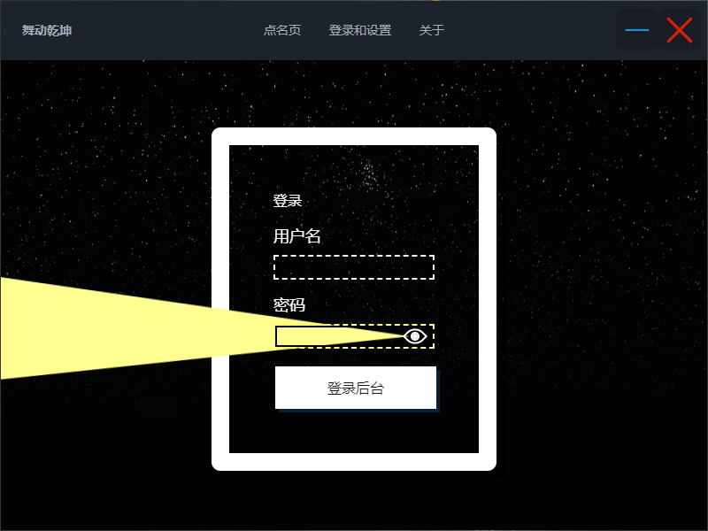
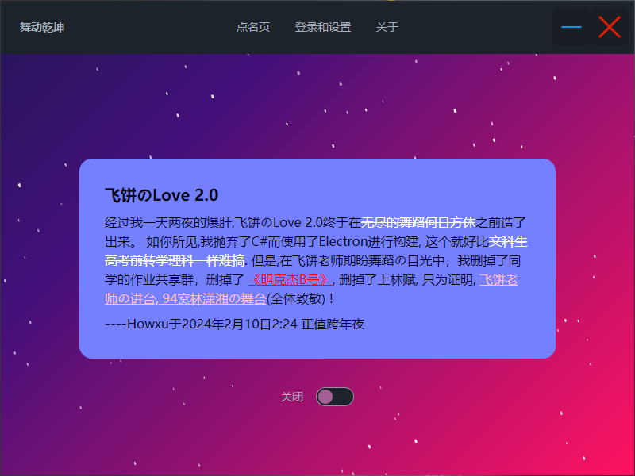

# Dance Everyday





纪念飞饼老师，和他绝唱的Power of English  

这是一个使用JS和Electron构建的UI极其精美的点名器，具有后台管理的功能以替换点名内容(在resources/res下的names.config)，点名的机制来自JS内置的简单随机数  

同时，我确实加入了可供两人使用的逃脱点名的机制，并且该机制可以设置触发时间，具体涉及文件`libTB.dll`  

names.config和libTB.dll文件都使用了**CryptoJS**的**AES加密**机制来保证不被修改  

# 使用

登录页中，在用户名框中填入文件名(写入时)或者文件路径(写出时)，在密码框中输入"decode_timetable", "decode_names", "encode_names", "encode_timetable"即可实现名称对应的写入写出  

点名内容格式遵循一行一名，也可以使用其他内容  

时间表遵循以下格式： 

``` 
true //开启时间限制
1 //周一
12:10 13:10 //在12:10-13:10不会点名内置的两个名字
12:16 13:12
12:36 13:11
2
12:10 13:10
7 //周日
12:10 13:10
```

# 开发

因为`libTB.dll`和`names.config`的创建来源不明，这个部分进一步的开发貌似陷入闭环，但是可以手动解决：  

在第一次`yarn dev`失败后，<font style="color:red">手动</font>将`libTB.dll`放入`项目根目录的node_modules/electron/dist`路径下，将`resouces`下的`res`文件夹放在`项目根目录的node_modules/electron/dist/resources`路径下。  

## 下载依赖

```
yarn
```

## 开发者模式

```
yarn dev
```

## 构建安装程序

```
yarn dist
```

更多详情访问`package.json`文件


# 写在最后

耗了春节假做的点名器没有帮助逃脱Dance的命运，飞饼老师拍下的四五十条视频也没有剪辑出多么引人注目的大片，甚至看的人寥寥无几。  

至少在回忆这个板块我拿得头筹。  
